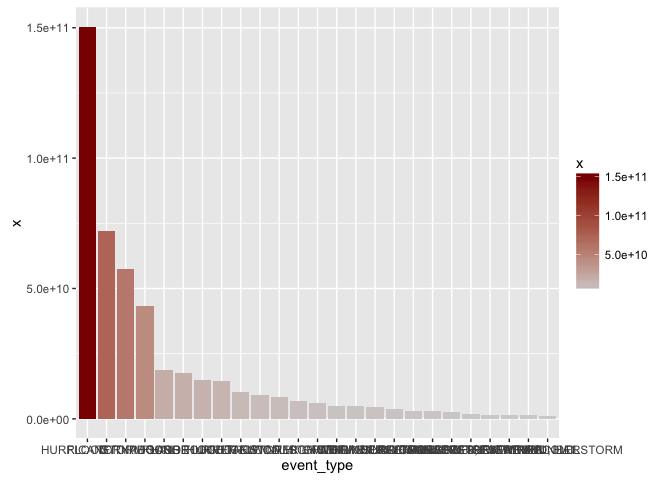

# Public Health and Economic Consequences of Severe Weather Events, 1950-2011

## SYNOPSIS

---


## DATA PROCESSING

First we download and extract the NOAA storm data.

```r
# Check for data dir
if (!file.exists("data")) {
  dir.create("data")
}

# Check for data source file, download if needed.
if (!file.exists("data/noaa_storm_data.bz2")) {
  download.file("https://d396qusza40orc.cloudfront.net/repdata%2Fdata%2FStormData.csv.bz2", destfile="data/noaa_storm_data.bz2", method="curl")
}

noaa <- read.csv('data/noaa_storm_data.bz2',
                 header = TRUE, stringsAsFactors = FALSE, strip.white=TRUE)
dim(noaa)
```

```
## [1] 902297     37
```

Since we're looking to determine the economic and human impacts of storm events, we should begin by determining how we'll measure each of these and preparing those data.

### Economic Impact

For economic impact, we'll combine property (`PROPDMG`) and crop (`CROPDMG`) damage into a total dollar value per incident.

In the specification document (https://d396qusza40orc.cloudfront.net/repdata%2Fpeer2_doc%2Fpd01016005curr.pdf, section 2.7) it is indicated that the numeric values of damage estimates are rounded to 3 significant digits, then abbreviated by a magnitude indicator

> Alphabetical characters used to signify magnitude include “K” for thousands, “M” for millions, and “B” for billions.

This magnitude indicator is in the `PROPDMGEXP` and `CROPDMGEXP` variables.  Some of the magnitude indicators don't follow the alpha guidelines, and so we don't know how to normalize them:


```r
# Total nonzero property damage event counts
nonzero_prop_counts <- table(noaa$PROPDMG > 0)
print(nonzero_prop_counts)
```

```
## 
##  FALSE   TRUE 
## 663123 239174
```

```r
# Table of event counts with nonzero property damage and invalid magnitude indicator
invalid_prop_magnitude_counts <- addmargins(table(noaa[noaa$PROPDMG > 0 & !grepl('[kKmMbB ]', noaa$PROPDMGEXP), ]$PROPDMGEXP))
print(invalid_prop_magnitude_counts)
```

```
## 
##       -   +   0   2   3   4   5   6   7   h   H Sum 
##  76   1   5 209   1   1   4  18   3   2   1   6 327
```

```r
# Percent of events with nonzero property damage that have an invalid magnitude indicator
(invalid_prop_magnitude_counts['Sum'] / nonzero_prop_counts['TRUE']) * 100
```

```
##       Sum 
## 0.1367205
```

```r
# Total nonzero crop damage event counts
nonzero_crop_counts <- table(noaa$CROPDMG > 0)
print(nonzero_crop_counts)
```

```
## 
##  FALSE   TRUE 
## 880198  22099
```

```r
# Table of event counts with nonzero crop damage and invalid magnitude indicator
invalid_crop_magnitude_counts <- addmargins(table(noaa[noaa$CROPDMG > 0 & !grepl('[kKmMbB ]', noaa$CROPDMGEXP), ]$CROPDMGEXP))
print(invalid_crop_magnitude_counts)
```

```
## 
##       0 Sum 
##   3  12  15
```

```r
# Percent of events with nonzero crop damage that have an invalid magnitude indicator
(invalid_crop_magnitude_counts['Sum'] / nonzero_crop_counts['TRUE']) * 100
```

```
##        Sum 
## 0.06787637
```

Since for both variables these comprise a proportionally very small number of incidents (both less than 0.15 percent), we'll simply exclude these incidents from our value calculations.

To normalize the values, we'll decompress and combine the values for property and crop damage, and combine them into a single total dollar value for each incident.


```r
# Populate a column with total economic cost per incident
noaa$economic_cost <- apply(noaa, 1, function(row){
  pval <- as.numeric(row['PROPDMG'])
  if (pval == 0 | !grepl('[kKmMbB ]', row['PROPDMGEXP'])){
    pval <- 0
  } else if (grepl('^[kK]$', row['PROPDMGEXP'])) {
    pval <- pval * 1000
  } else if (grepl('^[mM]$', row['PROPDMGEXP'])) {
    pval <- pval * 1000000
  } else if (grepl('^[bB]$', row['PROPDMGEXP'])) {
    pval <- pval * 1000000000
  }

  cval <- as.numeric(row['CROPDMG'])
  if (cval == 0 | !grepl('[kKmMbB ]', row['CROPDMGEXP'])){
    cval <- 0
  } else if (grepl('^[kK]$', row['CROPDMGEXP'])) {
    cval <- cval * 1000
  } else if (grepl('^[mM]$', row['CROPDMGEXP'])) {
    cval <- cval * 1000000
  } else if (grepl('^[bB]$', row['CROPDMGEXP'])) {
    cval <- cval * 1000000000
  }

  pval + cval
})
```

Now we can aggregate economic cost by event type and compare.
After aggregating, we order the output to be highest aggregate cost to lowest.
We also convert the event type to a factor and force-reorder the levels in the
same arrangement (for plotting purposes).


```r
aggregate_cost <- aggregate(noaa$economic_cost, by = list('event_type' = noaa$EVTYPE), sum)
aggregate_cost <- aggregate_cost[order(aggregate_cost$x, decreasing = TRUE), ]
aggregate_cost$event_type <- factor(aggregate_cost$event_type, levels = aggregate_cost[order(aggregate_cost$x, decreasing = TRUE), ]$event_type)
head(aggregate_cost, 25)
```

```
##                     event_type            x
## 170                      FLOOD 150319678250
## 411          HURRICANE/TYPHOON  71913712800
## 834                    TORNADO  57352113590
## 670                STORM SURGE  43323541000
## 244                       HAIL  18758221170
## 153                FLASH FLOOD  17562128610
## 95                     DROUGHT  15018672000
## 402                  HURRICANE  14610229010
## 590                RIVER FLOOD  10148404500
## 427                  ICE STORM   8967041310
## 848             TROPICAL STORM   8382236550
## 972               WINTER STORM   6715441250
## 359                  HIGH WIND   5908617560
## 957                   WILDFIRE   5060586800
## 856                  TSTM WIND   5038935790
## 671           STORM SURGE/TIDE   4642038000
## 760          THUNDERSTORM WIND   3897964190
## 408             HURRICANE OPAL   3191846000
## 955           WILD/FOREST FIRE   3108626330
## 299  HEAVY RAIN/SEVERE WEATHER   2500000000
## 786         THUNDERSTORM WINDS   1926607550
## 842 TORNADOES, TSTM WIND, HAIL   1602500000
## 290                 HEAVY RAIN   1427647890
## 140               EXTREME COLD   1360710400
## 604        SEVERE THUNDERSTORM   1205560000
```

Let's take a look at the event types and see if there's a clear cutoff

```r
library(ggplot2)
```

```
## Warning: package 'ggplot2' was built under R version 3.2.3
```

```r
library(gridExtra)

top_25 <- ggplot(head(aggregate_cost, 25), aes(x = event_type, y = x, fill = x)) + geom_bar(stat = 'identity') + scale_fill_gradient2(mid='lightgrey', high='darkred')

print(top_25)
```

 

---


## RESULTS
